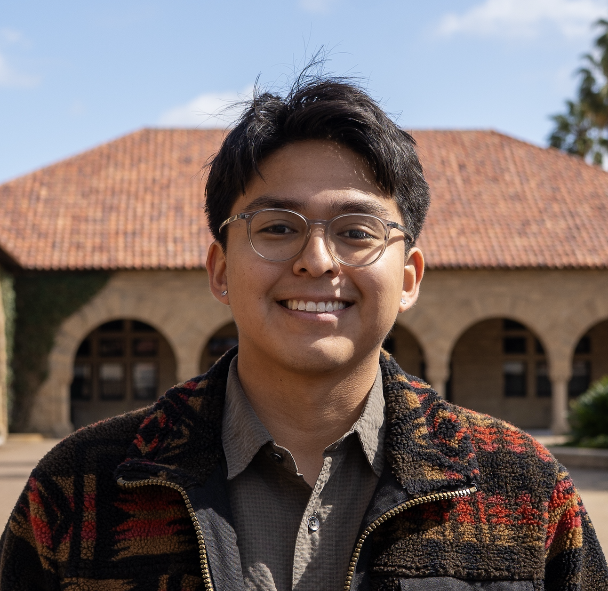
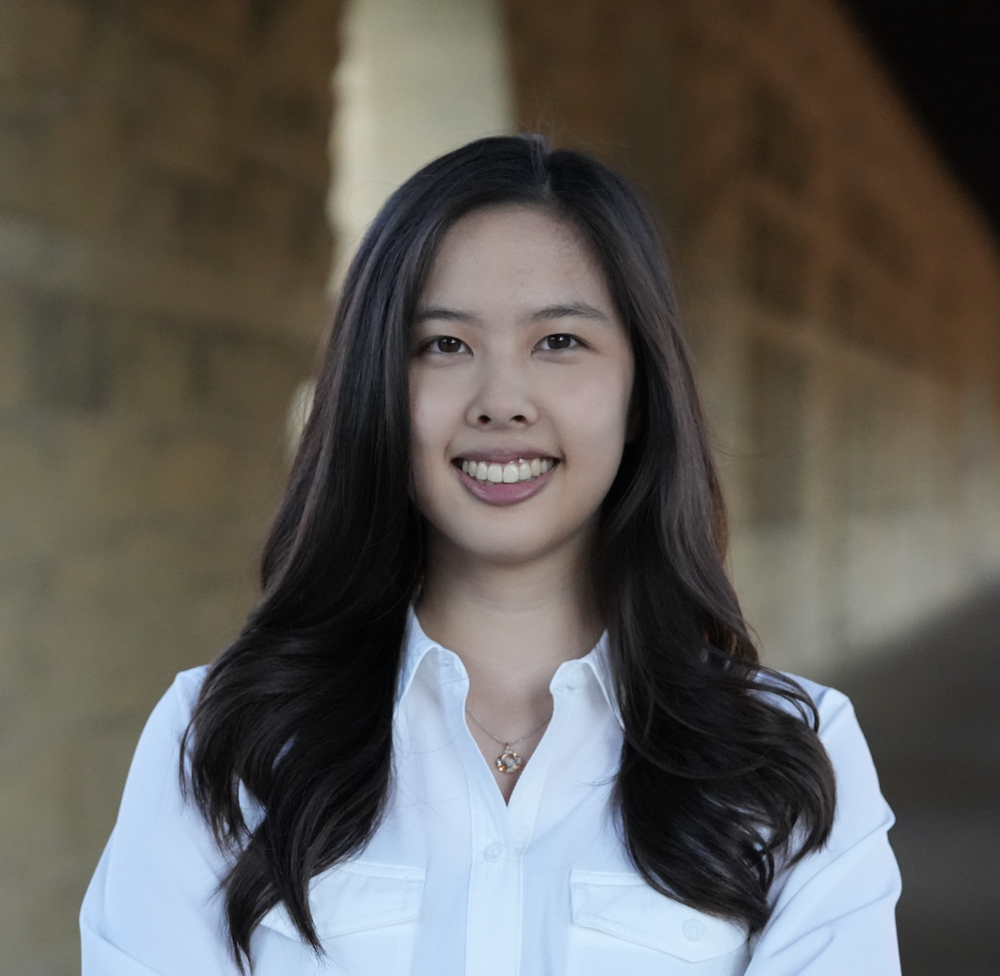
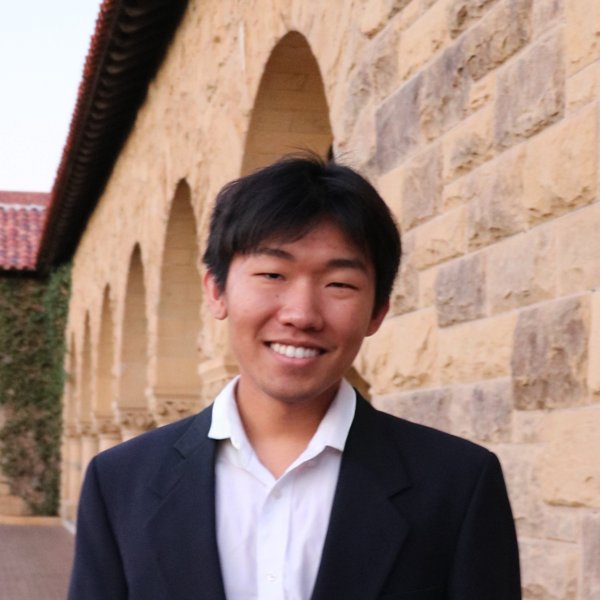
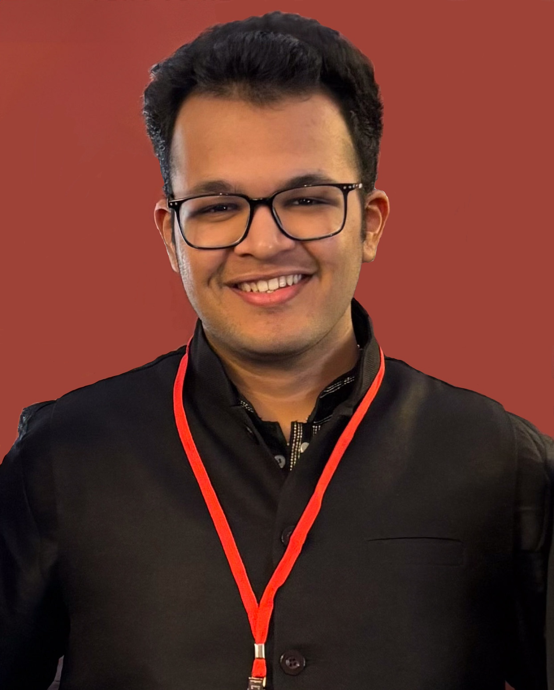

# Home

Team Name: CARTZ

Team Logo: 🎮

## Synopsis of Project 
Adapt-Ed is a dynamic educational game for learning high-level libraries like NumPy and Pandas based on a student’s skill, pace, and competitive drive. Instead of a fixed curriculum, LLMs identify where the student’s learning is falling short and generate new challenges to help fill that gap. Every character, puzzle, dialogue is a new learning opportunity. 

## Our Team
| | | | | | 
|---|---|---|---|---|
|  |  |  |  |  |
| Caleb | Annie | Tony | Rydham | Zaid 

Team Music: [Super Mario Theme Song](https://www.youtube.com/watch?v=NTa6Xbzfq1U)

## Team Member Matrix
Member | Skills | Personal Traits | Desired Growth | Weaknesses | Email
--- | --- | --- | --- | --- | --- |
Caleb Ketchum | Project Management, Familiarity with PCBs and breakout boards | Loves building things | Programming projects, team building | Short term memory | cketchum@stanford.edu
Annie Lee | AI/ML, RL, NLP | Disciplined, creative, adaptable| Building front-end / full-stack | Sleep schedule | annieee@stanford.edu
Tony Wang | Full-stack dev (Next.js, React, Postgres, etc.) + ML | Fast-moving | Shipping to production | Lower-level systems | wangtony@stanford.edu
Rydham Goyal | AI, Machine Learning, Programming, GUI skills | Loves learning new programming languages | MatLAB | bad memory | rydham@stanford.edu
Zaid Akhtar | Design/Frontend/Product | Love designing experiences/systems/things | Full-stack | Busy quarter, caught up in a lot | zaid26@stanford.edu
